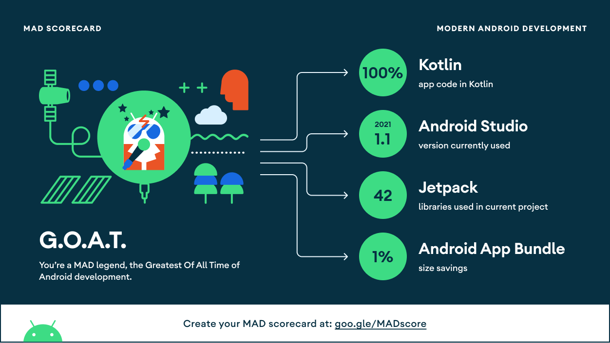
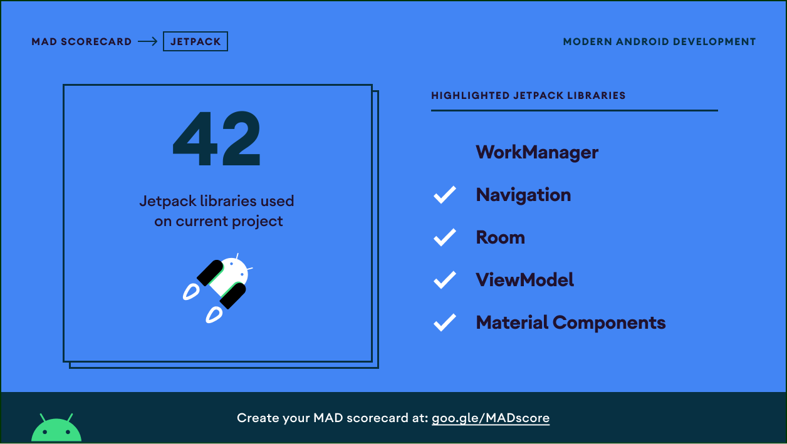

 <div id="top"></div>


<a href="https://www.android.com"></a>
<a href="https://kotlinlang.org"> </a>


<!-- LOGO -->
<br />
<h1>
<p align="center">
  
  <br>
  <b>Movies</b>
</h1>

This app displays a list of movies, tv shows and actors by consuming The Movie Database (TMDb) API using Android.

</p>
<p align="center">
<a href="#setup">Setup</a> •
  <a href="#components">Components</a> •
  <a href="#scorecards">Scorecards</a> •
  <a href="#license">License</a>
  
</p>  

<a href="https://gifyu.com/image/SLMnW"></a>

## Setup

### Requirements

- Java 8
- Latest version of Android SDK and Android Build Tools

### API Key

The app uses themoviedb.org API to get movie information and posters. You must provide your own [API key] in order to build the app (or you can use mine).

Just put your API key into the app module's `utils/constants` file (create the file if it does not exist already):

```kotlin
const val TMDb_API_KEY = "abc123"
```

## Components

* [Kotlin](https://kotlinlang.org/) based, [Coroutines](https://github.com/Kotlin/kotlinx.coroutines) + [Flow](https://kotlin.github.io/kotlinx.coroutines/kotlinx-coroutines-core/kotlinx.coroutines.flow/) for asynchronous programming.
* [Dagger Hilt](https://dagger.dev/hilt/) for dependency injection.
* [JetPack](https://developer.android.com/jetpack)
	+ [DataStore]()
	+ Room - construct a database using the abstract layer.
	+ Worker - Updating data periodically when phone is idling
	+ [Bindables](https://github.com/skydoves/bindables) - Android DataBinding kit for notifying data changes to UI layers.
+ Lifecycle - dispose of observing data when lifecycle state changes.
+ ViewModel - UI related data holder, lifecycle aware.
* Architecture
	+ MVVM Architecture (View - DataBinding - ViewModel - Model)
* [Material 3](https://m3.material.io/) - Using Material Design 3
	+ [Navigation Drawer](https://material.io/components/app-bars-bottom)
	+ [Dark Mode Support](https://developer.android.com/guide/topics/ui/look-and-feel/darktheme) - Generate theme trough [Material Theme Builder](https://material-foundation.github.io/material-theme-builder/#/dynamic)
* [Retrofit2 & OkHttp3](https://github.com/square/retrofit) - construct the REST APIs and paging network data.
* [Glide](https://github.com/bumptech/glide) - loading images.
* [Material-Components](https://github.com/material-components/material-components-android) - Material design components like ripple animation, cardView.


## Scorecards





## License 

```
MIT License

Copyright (c) 2022 Jonathan Areas

Permission is hereby granted, free of charge, to any person obtaining a copy
of this software and associated documentation files (the "Software"), to deal
in the Software without restriction, including without limitation the rights
to use, copy, modify, merge, publish, distribute, sublicense, and/or sell
copies of the Software, and to permit persons to whom the Software is
furnished to do so, subject to the following conditions:

The above copyright notice and this permission notice shall be included in all
copies or substantial portions of the Software.

THE SOFTWARE IS PROVIDED "AS IS", WITHOUT WARRANTY OF ANY KIND, EXPRESS OR
IMPLIED, INCLUDING BUT NOT LIMITED TO THE WARRANTIES OF MERCHANTABILITY,
FITNESS FOR A PARTICULAR PURPOSE AND NONINFRINGEMENT. IN NO EVENT SHALL THE
AUTHORS OR COPYRIGHT HOLDERS BE LIABLE FOR ANY CLAIM, DAMAGES OR OTHER
LIABILITY, WHETHER IN AN ACTION OF CONTRACT, TORT OR OTHERWISE, ARISING FROM,
OUT OF OR IN CONNECTION WITH THE SOFTWARE OR THE USE OR OTHER DEALINGS IN THE
SOFTWARE.
```


<!-- MARKDOWN LINKS & IMAGES -->
<!-- https://www.markdownguide.org/basic-syntax/#reference-style-links -->


[contributors-shield]: https://img.shields.io/github/contributors/ISW-IAW/SistemaContable.svg?style=for-the-badge
[contributors-url]: https://github.com/ISW-IAW/SistemaContable/graphs/contributors
[forks-shield]: https://img.shields.io/github/forks/ISW-IAW/SistemaContable.svg?style=for-the-badge
[forks-url]: https://github.com/ISW-IAW/SistemaContable/network/members
[stars-shield]: https://img.shields.io/github/stars/ISW-IAW/SistemaContable.svg?style=for-the-badge
[stars-url]: https://github.com/ISW-IAW/UCASH/stargazers
[issues-shield]: https://img.shields.io/github/issues/ISW-IAW/SistemaContable.svg?style=for-the-badge
[issues-url]: https://github.com/ISW-IAW/SistemaContable/issues
[license-shield]: https://img.shields.io/github/license/ISW-IAW/SistemaContable.svg?style=for-the-badge
[license-url]: https://github.com/ISW-IAW/SistemaContable/blob/master/LICENSE
[product-screenshot]: images/screenshot.png